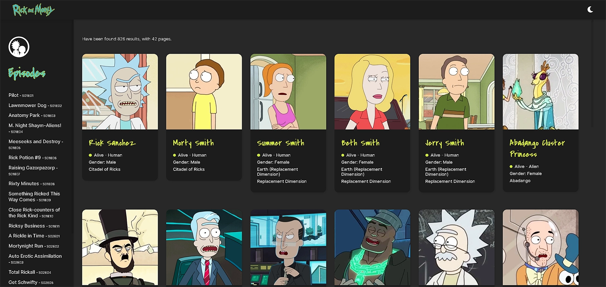

# GraphQL React Rick & Morty with color theme switcher



This application gives some information about the Rick and Morty cartoon, such us charaters, locations and episodes.

## Table of contents

- [Overview](#overview)
  - [About App](#about-app)
  - [Links](#links)
- [My process](#my-process)
  - [Built with](#built-with)
  - [What I learned](#what-i-learned)
  - [Useful resources](#useful-resources)
- [Getting Started](#getting-started)
  - [System Requirements](#system-requirements)
  - [Installation](#installation)
  - [Bugs](#bugs)
  - [Contributing](#contributing)
- [Author](#author)

## Overview

### About App

This application gives some information about about the Rick and Morty cartoon:

- See all charaters on the homepage
- See all episodes on the sidebar
- Click on a charaters, locations and episodes to see more detailed information on a separate page
- Click through to the charaters, locations and episodes on the detail page
- Toggle the color scheme between light and dark mode
- Button scroll to top after the scrool
- Error page/messages
- LocalStorage save of the set light or dark mode theme

### Links

- Repository URL: [github](https://github.com/denielden/gql-react-rick-morty)
- Live Site URL: [live site](https://gql-react-rick-morty.netlify.app)

## My process

### Built with

- Semantic HTML5 markup
- CSS custom properties
- Flexbox
- Css Grid
- [React](https://reactjs.org/) - JS library
- [React Router](https://reactrouter.com/) - For routes
- [GraphQL](https://graphql.org/) - Data
- [Apollo client](https://www.apollographql.com/) - Client
- [Styled Components](https://styled-components.com/) - For styles
- [React Spinners](https://www.npmjs.com/package/react-spinners)

### What I learned

I had a lot of fun in this project and I was able to learn how to:
- write **GraphQL** Queries
- use and configure **Apollo client** with React

I initially had trouble understanding how to use GraphQL in components and how to pass data. I find it a bit limiting the fact of having to bind the query to a component and not being able to simply return the data.

### Useful resources

- [React Router](https://reactrouter.com/docs/en/v6) - Docs
- [Styled Components](https://styled-components.com/docs) - Docs
- [GraphQL](https://graphql.org/) - Docs
- [Apollo GraphQL](https://www.apollographql.com/docs/react/) - Docs
- [Rick and Morty API - GraphQL](https://rickandmortyapi.com) - Docs

## Getting Started

In order to view this project locally, you need to make sure you clone this repository and install it's dependencies.

### System Requirements

- [git][https://git-scm.com/] 2.34 or greater
- [node][https://nodejs.org/en/] 17.5 or greater
- [npm][https://nodejs.org/en/] 8.3.0 or greater

To check which versions you have installed you can run these commands:
```
git --version
node --version
npm --version
```
If requirements above are not installed in your computer, you'll need to install them. By clicking on them you can go to their website, which can lead you the way.

### Installation

- Clone the repository
  ```sh
  git clone https://github.com/denielden/gql-react-rick-morty.git
  ```
- Navigate to repository folder
  ```sh
  cd gql-react-rick-morty
  ```
- Install npm packages
  ```sh
  npm install
  ```
- To run the app in the development mode run in the project directory: 
  ```sh
  npm start
  ```

### Bugs

Please feel free to create an issue if you see a bug or something unexpected in the app.

### Contributing

- Fork the Project
- Create your Feature Branch (`git checkout -b feature/yourFeature`)
- Commit your Changes (`git commit -m 'Brief explanation of feature`')
- Push to the Branch (`git push origin feature/yourFeature`)
- Open a Pull Request

## Author

- Website - [denielden](https://denielden.github.io)


## **Have fun building!** 🚀